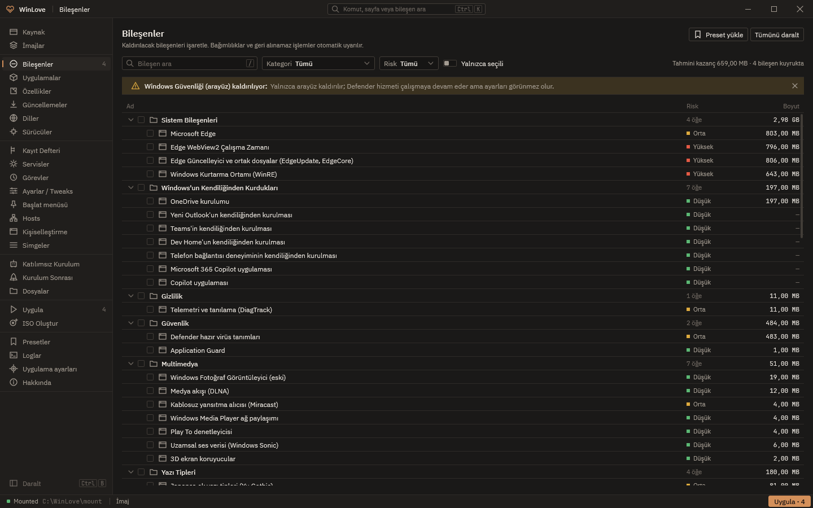
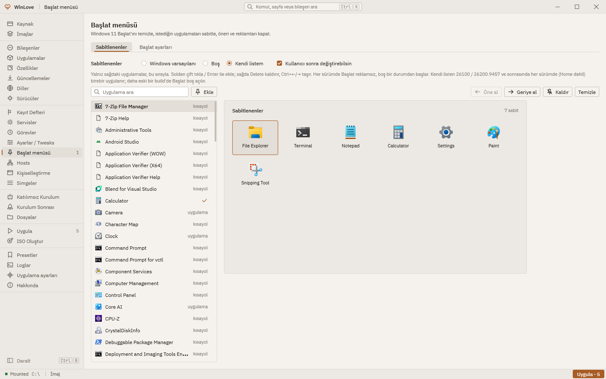
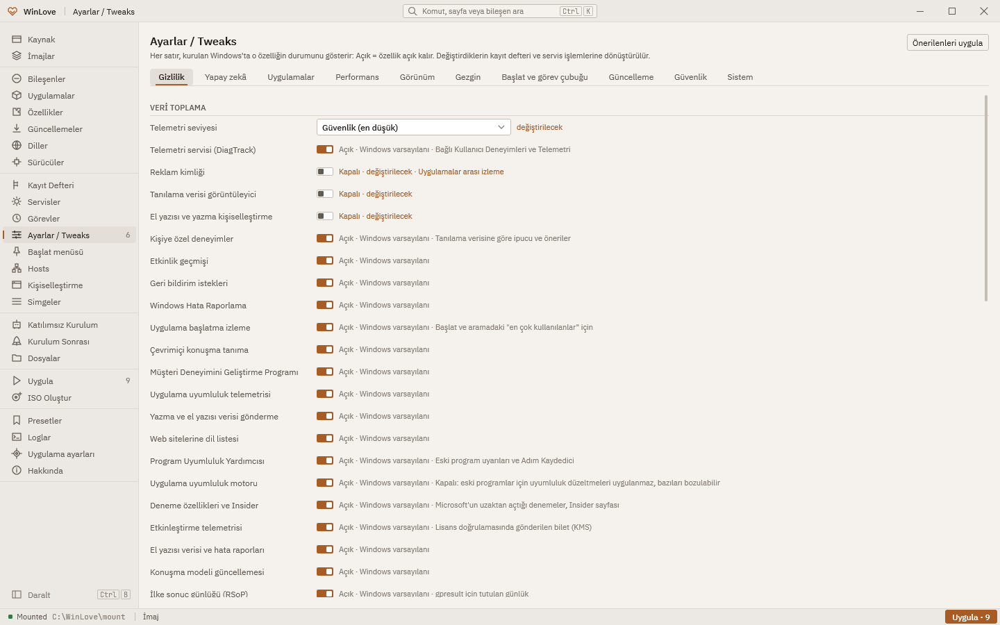
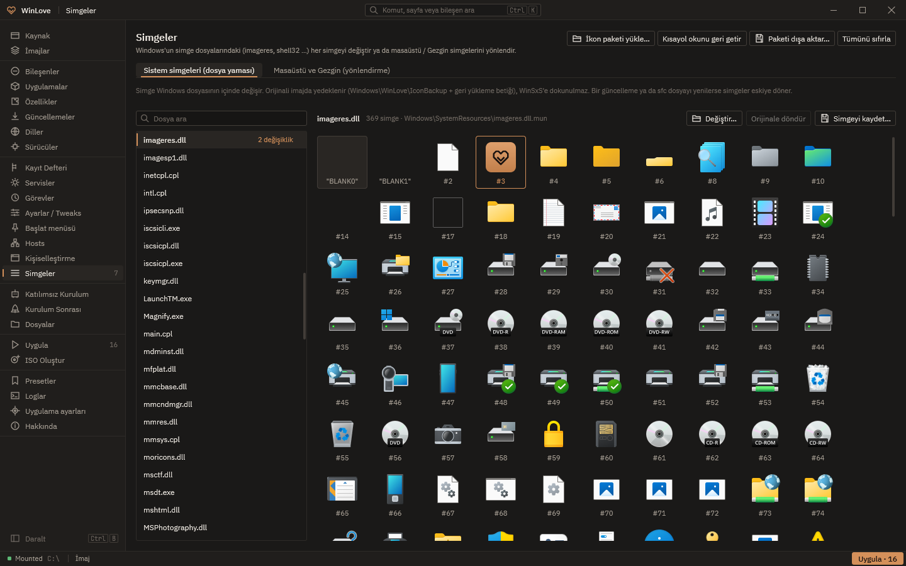
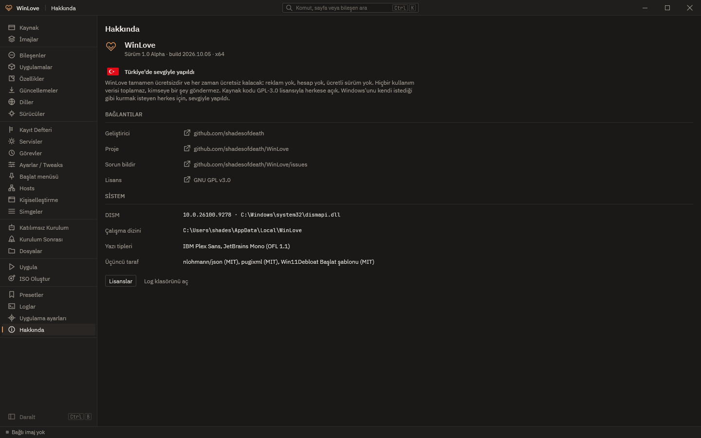

<p align="center">
  
</p>

<h1 align="center">WinLove</h1>

<p align="center">
  Windows imajlarını istediğin gibi hazırla: bileşen kaldır, ayarla, temizle, ISO'ya dök.<br>
  <b>Tamamen ücretsiz · açık kaynak · Türkiye'de sevgiyle yapıldı 🇹🇷</b>
</p>

<p align="center">
  <a href="https://github.com/shadesofdeath/WinLove/releases"></a>
  <a href="LICENSE"></a>
  
</p>

---

> **1.0.1 Alpha.** WinLove erken bir sürüm. Değişiklikleri önce bir sanal makinede dene; asıl imajının yedeğini tut.
> WinLove yalnızca **çevrimdışı imajlarla** çalışır (ISO / WIM / ESD); çalışan sistemine dokunmaz.



## Neler yapar

| | |
|---|---|
| **Kaynak ve imajlar** | ISO, WIM, ESD açar; sürümleri listeler, bağlar, dışa aktarır, siler; ESD → WIM. |
| **Bileşenler ve uygulamalar** | Hazır gelen uygulamaları ve sistem bileşenlerini kaldırır (Edge, OneDrive, WinRE, eski sürücüler…); bağımlılıkları ve riski önceden söyler. |
| **Windows'un kendiliğinden kurdukları** | Yeni Outlook, Teams, Dev Home, Telefon Bağlantısı, Microsoft 365 Copilot, Copilot ve OneDrive'ın kurulumdan sonra kendiliğinden gelmesini kökünden durdurur (Windows Update zamanlayıcısı, yedek paketler, "istenmiyor" işaretleri — sanal makinede ölçüldü). |
| **Başlat menüsü** | Windows 11 Başlat'ını reklamsız ve boş başlatır ya da kendi uygulama listeni sabitler — Home dahil her sürümde. |
| **Ayarlar / Tweaks** | 280+ ayar on sekmede: gizlilik, yapay zekâ, uygulamalar, performans, görünüm, Gezgin, Başlat ve görev çubuğu, güncellemeler, güvenlik, sistem. |
| **Özellikler, güncellemeler, sürücüler, diller** | İsteğe bağlı özellikler; Microsoft Update Kataloğu'ndan toplu güncelleme indirme ve ekleme; sürücü ekleme / kaldırma; dil paketleri. |
| **Kayıt defteri, servisler, görevler, hosts** | Kendi kayıt değerlerin ve .reg dosyaların; servis başlangıç türleri; zamanlanmış görevler; hosts listeleri. |
| **Simgeler ve kişiselleştirme** | Windows'un kendi simge dosyalarındaki simgeleri yedekleyerek değiştirir, 7TSP simge paketlerini (.7z / .zip) tek seferde uygular; duvar kâğıdı, OEM bilgileri, yazı tipleri. |
| **Katılımsız kurulum ve sonrası** | `autounattend.xml` (yerel hesap, TPM / Secure Boot atlama, OOBE), kurulumdan sonra çalışacak uygulamalar, Wi-Fi, betikler. |
| **ISO ve USB** | Önyüklenebilir ISO (UEFI / BIOS) ya da USB bellek; presetlerle aynı ayarları tekrar uygula. |

<p>
  
  
</p>
<p>
  
  
</p>

## Kurulum

1. [Sürümler](https://github.com/shadesofdeath/WinLove/releases) sayfasından `WinLove.exe`'yi indir.
2. Çalıştır — kurulum yok, tek dosya. İmaj bağlamak için yönetici izni ister.

**Gereken:** Windows 10 veya 11, x64. İşlenen imajlar x64 ya da ARM64 olabilir.

## Söz

WinLove tamamen ücretsizdir ve her zaman ücretsiz kalacak: reklam yok, hesap yok, ücretli sürüm yok.
Hiçbir kullanım verisi toplamaz, kimseye bir şey göndermez. Windows'unu kendi istediği gibi kurmak isteyen
herkes için, sevgiyle yapıldı.

## Derleme

Visual Studio 2026 (MSVC, C++23), Windows SDK 10.0.26100 ve Python 3 gerekir.

```powershell
./build.ps1              # Debug
./build.ps1 -Test        # birim testleri
./build.ps1 -Dist        # Release + testler + dist\WinLove.exe
```

Arayüz Direct2D / DirectWrite ile tamamen kendi çizimimiz; motor DISM API, wimgapi ve çevrimdışı kayıt defteri
üzerinde kendi katmanımız. Ayrıntılar: [`docs/`](docs).

## Katkı ve geri bildirim

Hata ya da öneri için bir [issue](https://github.com/shadesofdeath/WinLove/issues) aç.

## Lisans

[GNU GPL v3.0](LICENSE). Pakete giren üçüncü taraf bileşenler ve lisansları: IBM Plex Sans ve JetBrains Mono
(SIL OFL 1.1), nlohmann/json ve pugixml (MIT), Win11Debloat boş Başlat şablonu (MIT) — bkz. `third_party/`.

---

<p align="center">Geliştirici: <a href="https://github.com/shadesofdeath">@shadesofdeath</a></p>
